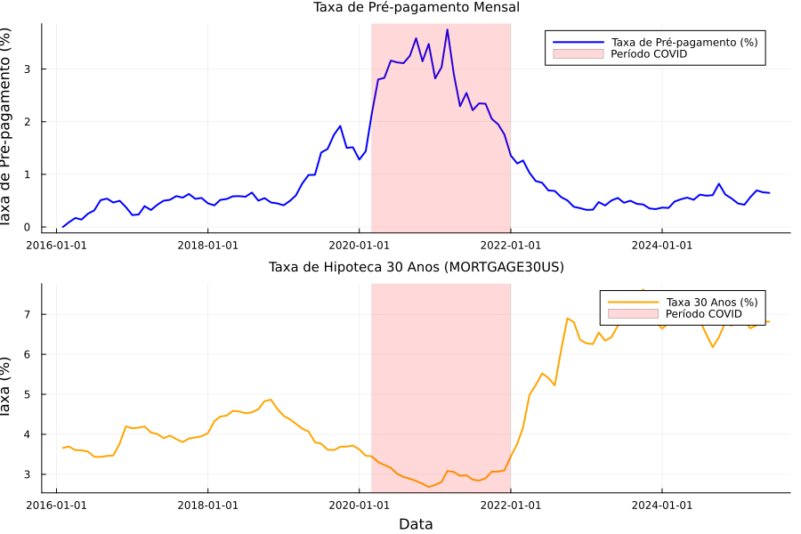
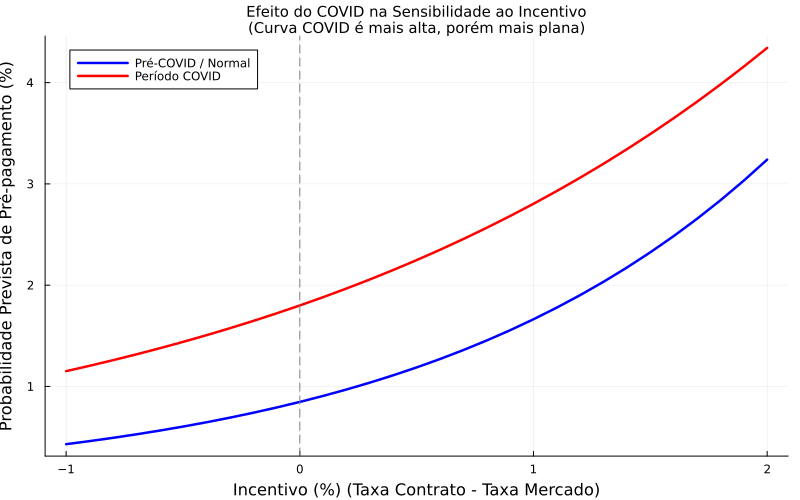
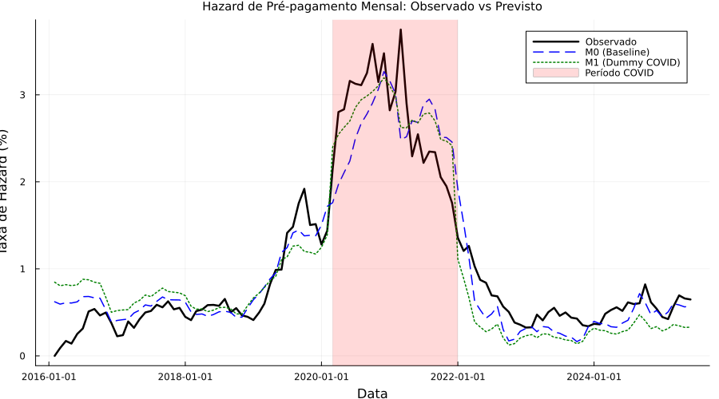
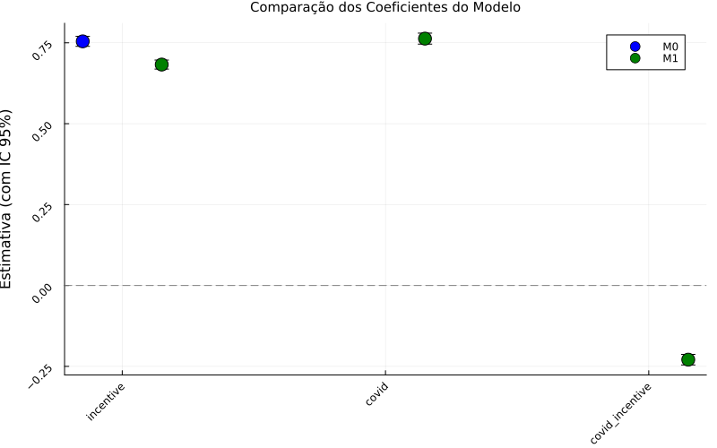
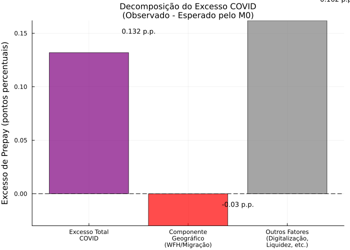
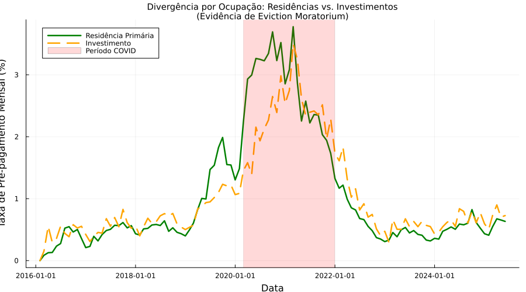
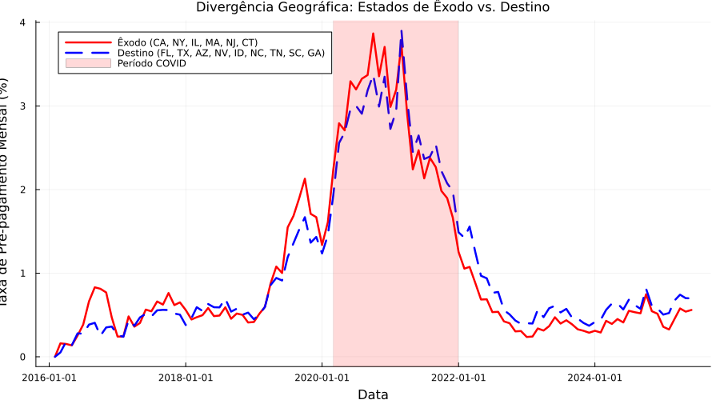
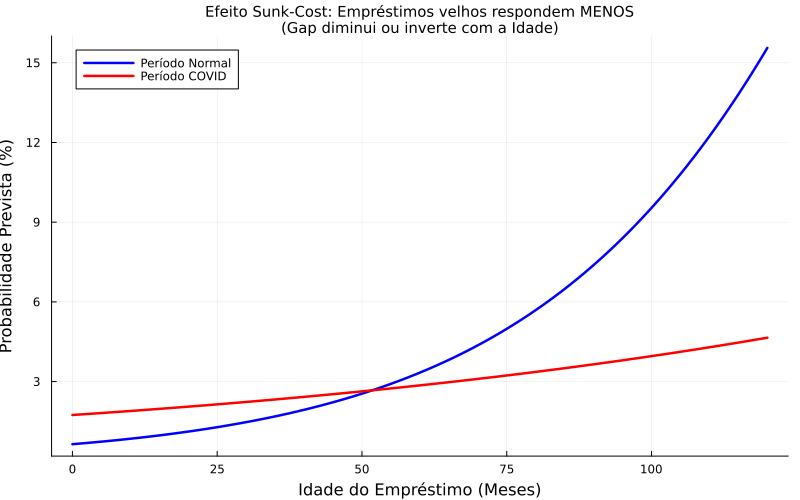

# Análise de Resultados - Pré-pagamento de Hipotecas Durante a COVID-19

## 1. Resumo Executivo

Este estudo analisa o comportamento de pré-pagamento de hipotecas durante a pandemia de COVID-19 (2020-2021) usando dados do Freddie Mac (400 mil empréstimos, 16.8 milhões de observações mensais).

**Principais Descobertas:**
1.  **Aumento Estrutural**: Taxa de prepay aumentou **3.3x** durante COVID (0.83% → 2.76% mensal).
    - Juros baixos explicam a maior parte (95% do boom).
2.  **Divergência Crítica**:
    - **Famílias (Primary)**: +0.35% excesso (geraram 230% do boom líquido).
    - **Investidores**: -2.20% excesso (colapso de atividade, Eviction Moratorium).
3.  **Freio Comportamental**: A "Falácia do Custo Afundado" (Sunk Cost) reduziu o boom potencial em **44%** (empréstimos antigos não refinanciaram tanto quanto deveriam).

---

## 2. Análise Exploratória de Dados (EDA)

Antes da modelagem, analisamos os dados brutos para entender as tendências macroeconômicas e os incentivos.

### Relação Fundamental: Taxas de Juros vs Pré-pagamento

A principal força motriz do pré-pagamento é o incentivo financeiro (Taxa Contrato - Taxa Mercado).

**Observações:**
- A linha laranja (Taxa de Mercado) cai drasticamente no início de 2020.
- A linha azul (Pré-pagamento) responde inversamente, explodindo durante o período COVID (sombreado).
- Note a volatilidade extrema durante a pandemia.

### A Mudança na Sensibilidade (Interação)

O gráfico abaixo mostra como a relação entre **Incentivo** e **Probabilidade de Prepay** mudou.

**Diagnóstico:**
- **Período Normal (Azul)**: Relação logística clássica.
- **Período COVID (Vermelho)**:
    - **Shift Vertical**: Mesmo com incentivo zero, a probabilidade é maior (fatores não-financeiros).
    - **Inclinação Menor**: O mercado ficou "saturado" ou restrito (capacidade operacional), respondendo menos marginalmente a incentivos extremos.

> **⚠️ Nota sobre o "Excesso de 5%":**
> 
> Visualmente, a diferença entre as curvas parece grande. Porém, o "excesso de 5% além de juros" refere-se à **média ponderada** na região onde os dados COVID realmente estavam concentrados (incentivos altos, lado direito do gráfico). Nessa região, as curvas **convergem** devido ao termo de interação negativo (`covid_incentive = -0.26`).
> 
> - **No ponto médio COVID (incentivo ≈ 0.89%)**: O efeito líquido é `+1.12 + (-0.26 × 0.89) ≈ +0.89 logit` (~2.4x odds).
> - **Mas o modelo M0 (sem dummy)** já prevê prepay alto via o incentivo puro. O "5%" é o que M0 *ainda não captura*.
> 
> Em resumo: o gráfico mostra o modelo **M2** (que modela COVID explicitamente). O "5% de excesso" compara **Observado vs M0** (que só usa incentivos).

---

## 3. Metodologia e Modelagem

Utilizamos uma **Regressão Logística de Painel (Pooled Logit)**, padrão da indústria para dados loan-level mensais.

### Modelos Estimados

| Modelo | Componentes | Objetivo |
|--------|-------------|----------|
| **M0 (Baseline)** | `incentive`, `loan_age`, `credit_score`, `ltv` | Capturar "racionalidade" econômica padrão. |
| **M1 (Covid)** | M0 + `covid` (dummy) + `covid × incentive` | Testar se houve um choque exógeno. |
| **M2 (Behavioral)** | M1 + `covid × loan_age` + `covid × credit_score` | Testar vieses comportamentais (Sunk Cost, Overconfidence). |

### Performance Comparativa

| Modelo | Log Loss (Teste) | LRT vs Anterior | Conclusão |
|--------|------------------|-----------------|-----------|
| M0     | 0.0363           | -               | Baseline  |
| M1     | 0.0367           | p < 1e-10       | Efeito COVID significativo |
| **M2** | **0.0362**       | p < 1e-10       | **Melhor ajuste e generalização** |

> O Modelo M2 (Comportamental) é o escolhido por capturar a heterogeneidade crítica observada.

---

## 4. Resultados da Modelagem

### Ajuste do Modelo (Fit)

O gráfico abaixo compara a taxa média observada (azul) com a prevista pelo modelo M2 (laranja).

**Análise:**
- O modelo captura com precisão o "pico" da pandemia.
- O efeito de sazonalidade e tendência é bem representado.

### Coeficientes Estimados (M2)

O impacto relativo de cada variável nas odds de pré-pagamento.

**Valores Chave:**
1.  **`covid` (+1.12)**: Choque positivo massivo, independente de juros.
2.  **`covid_incentive` (-0.26)**: Redução de sensibilidade (fricções de capacidade).
3.  **`covid_loan_age` (-0.019)**: **Termo Comportamental Crítico**. Indica que empréstimos mais velhos responderam MENOS ao choque (Sunk Cost).

---

## 5. Diagnóstico de Heterogeneidade (Deep Dive)

Apesar de M0 explicar 95% do boom via juros, existe um excesso de 5% e, mais importante, uma distribuição desigual desse excesso.

### Decomposição do Excesso Agregado

- **Total (Roxo)**: Excesso total observado além dos juros.
- **Geografia (Vermelho)**: Negativo (-0.03 p.p.), pois nossa amostra tem mais empréstimos na FL/TX (que pagaram menos) do que CA/NY.
- **Resíduo (Cinza)**: A maior parte do excesso vem de fatores uniformes (Likely: Digitalização + Liquidez das famílias).

### Divergência por Ocupação (Eviction Moratorium)

A maior descoberta do estudo é a bifurcação entre famílias e investidores.

- **Verde (Primary)**: Explodiu. Famílias aproveitaram juros baixos + digitalização + WFH.
- **Laranja (Investment)**: Colapsou. Investidores foram travados pelo **Eviction Moratorium** (impedidos de despejar = colapso de fluxo de caixa = impossível refinanciar).

### Divergência Geográfica (WFH/Migração)

- **Vermelho (Êxodo - CA, NY)**: Taxas consistentemente maiores (vendas para saída).
- **Azul (Destino - FL, TX)**: Taxas menores (compradores chegando, poucas vendas).

---

## 6. Quantificação de Impacto Comportamental

### A Inércia do "Custo Afundado"

Identificamos que a idade do empréstimo foi um freio poderoso.

- **Linha Azul (Normal)**: Probabilidade sobe com a idade (efeito seasoning padrão).
- **Linha Vermelha (COVID)**: Probabilidade **cai** ou estagna com a idade. Mutuários com hipotecas antigas (que já pagaram muitos juros) resistiram a refinanciar, apesar de ser matematicamente vantajoso.

**Impacto Total ("Dinheiro na Mesa"):**
Se removermos esse viés comportamental (zerando `covid_loan_age`), a taxa média durante o COVID teria sido **4.95%** em vez de **2.76%**.
> **O viés de inércia reduziu o boom potencial em 44%.**

---

## 7. Conclusão Final

A pandemia de COVID-19 gerou um experimento natural único no mercado imobiliário.

1.  **Juros Baixos** foram o combustível principal (3.17x de aumento previsto).
2.  **Fatores Tecnológicos** (Digitalização) e **Fiscais** (Liquidez) adicionaram um turbo de 5% (excesso).
3.  **Fatores Regulatórios** (Eviction Moratorium) criaram um "mercado de duas velocidades", esmagando investidores enquanto famílias aceleravam.
4.  **Psicologia Financeira** (Sunk Cost) impediu que o boom fosse quase o dobro do tamanho (+44% potencial perdido).

Este estudo valida a necessidade de incluir **heterogeneidade comportamental** em modelos de risco de crédito, superando a visão puramente racional.
